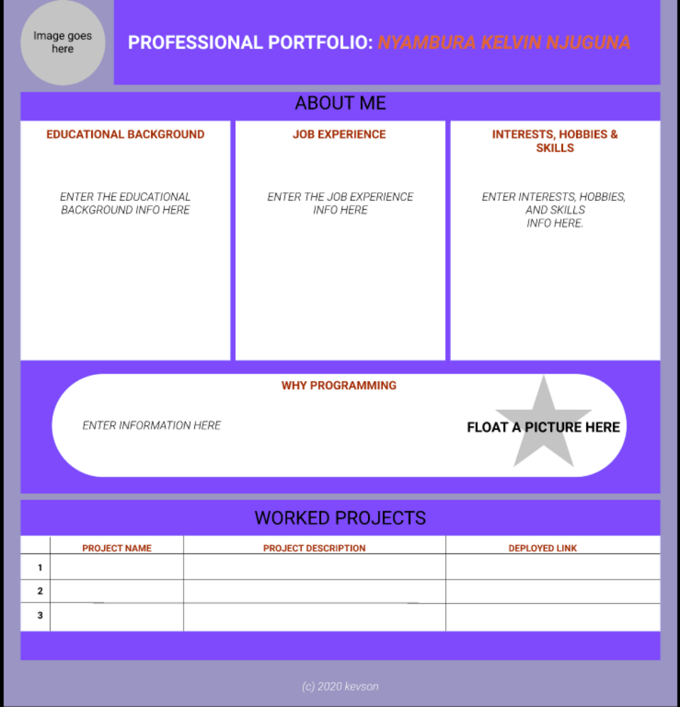

# Portfolio Landing Page
#### This is a website containing information about my Professional Portfolio
#### By **Nyambura Kelvin Njuguna**

## Description.
The portfolio landing page is a website that present information about who I am, my Educational background, working experience, interests, skills, and hobbies. It also present information about why i have interest in programming.

## Prototype.

## Setup/Installation Requirements.
* Install Google Chrome on your machine.
* click the live link i.e. open the live link using google chrome to view the portfolio land webpage.

## Live link.
https://kevson102.github.io/Portfolio-Landing-Page/

## Known Bugs
NONE
## Technologies Used
1. HTML
2. CSS
## Support and contact details
Email: Kevson3941@gmail.com
Phone no. +254 733 916258
### License
<a href="./LICENSE.MD">MIT</a>

Copyright (c) 2021 **Portfolio Landing page-Nyambura Kelvin Njuguna**